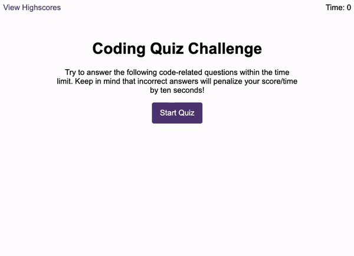

# Code Quiz

This application is designed to challenge users with a series of coding-related questions, providing an engaging way to enhance their JavaScript knowledge.

## Features

- Countdown timer starts when user clicks Start Quiz.
- Multiple-choice questions focusing on JavaScript programming.
- Audio feedback for correct and incorrect answers.
- Option for users to submit their intials when time is up or after completing the quiz
- Scoring system to track and display the high scores stored in local storage
- Clean, polished and responsive UI.

## Technologies Used

- **Frontend:** HTML, CSS and JavaScript
- **Version Control:** Git

## Screenshot

## Link to Project

The live version of this project can be found [here](https://caseygirlyn.github.io/Code-Quiz/).

## License

This project is licensed under the [MIT License](LICENSE).